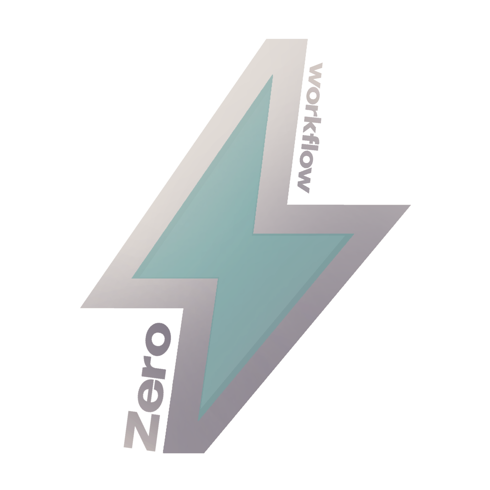

# ZeroWorkflow

[🇷🇺 RU](doc/lang/README.ru.md)



[](https://golang.org/)
[](LICENSE)
[](https://github.com/derxanax/ZeroWorkflow/releases)

> AI-powered developer tools suite for streamlined workflow automation

## 🧶 About

ZeroWorkflow is a collection of AI-powered command-line utilities designed to automate common development tasks. Built with Go for maximum performance and cross-platform compatibility.

**Key Features:**
- **Modular Architecture** - Easy to extend with new commands
- **Beautiful Terminal UI** - Rich markdown rendering with code highlighting
- **Cross-Platform** - Single binary deployment

## 🌐 Supported Platforms

[](https://www.linux.org/)
[](https://www.apple.com/macos/)
[](https://www.microsoft.com/windows/)

## ⚡️ Quick Start

### Installation

#### Quick Install (Recommended)
```bash
# Download and install the latest release
curl -L https://github.com/zeroworkflow/zw/releases/download/v1.0.9/install.sh | bash
```

### Setup

1. **Automatic setup** :
   - The installer creates a `.env` template file
   - Edit `.env` and add your AI token

2. **Get your AI token**:
   - Visit [Z.ai](https://chat.z.ai) to get your API token
   - Free keys [zw-free keys](https://github.com/zeroworkflow/zw-keys)
   - Add it to `.env` file or set as environment variable

## 🛠 Commands

### `zw ask` - AI Assistant

Interactive AI assistant with markdown rendering and syntax highlighting.

**Examples:**
```bash
# Ask a question
zw ask "How to create a REST API in Go?"

# Include files for context
zw ask "Review my code" --file main.go
zw ask "Explain this function" -f utils.go

# Interactive mode
zw ask -i
```

**Features:**
- [I] Syntax highlighting for code blocks
- ! Rich markdown rendering
- @ Interactive conversation mode
- ! **File context support** - Include files for AI analysis
- [I] Beautiful terminal formatting
- ! Safe file handling with size limits

## 💼 Project Structure

```text
ZeroWorkflow/
├── src/                   # Source code
│   ├── cmd/               # CLI commands
│   │   ├── root.go        # Root command setup
│   │   └── ask.go         
│   ├── internal/          # Internal packages
│   │   ├── ai/            # AI client implementation
│   │   │   └── client.go 
│   │   └── renderer/      
│   │       └── markdown.go
│   └── main.go            # Application entry point
├── assets/                
│   └── image/logo/        
├── doc/                   
│   ├── lang/              
│   └── ask.md             
├── go.mod                 # Go module definition
└── .env                   
```

## 🪵 Development

### Prerequisites
- Go 1.21 or higher
- Terminal with 256-color support

### Building from Source

#### Using Makefile 
```bash
# Clone repository
git clone https://github.com/derxanax/ZeroWorkflow.git
cd ZeroWorkflow

# Build
make build

# Install globally
make install

# Run tests
make test

# Development build with race detection
make dev
```

### Adding New Commands
1. Create new command file in `src/cmd/`
2. Implement command logic
3. Register with root command
4. Add documentation


## 📄 License

This project is licensed under the MIT License - see the [LICENSE](LICENSE) file for details.s

---

<div align="center">
  <strong>Built with ❤️ by <a href="https://github.com/derxanax">@derxanax</a></strong>
</div>